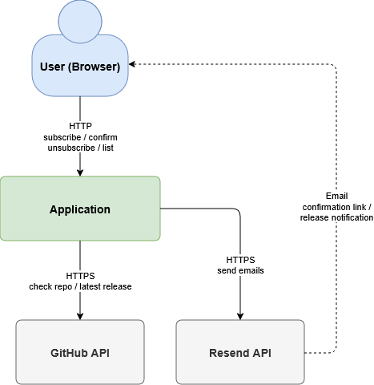
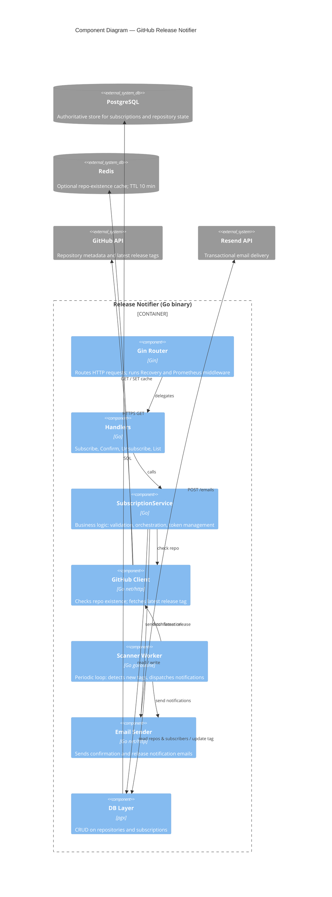
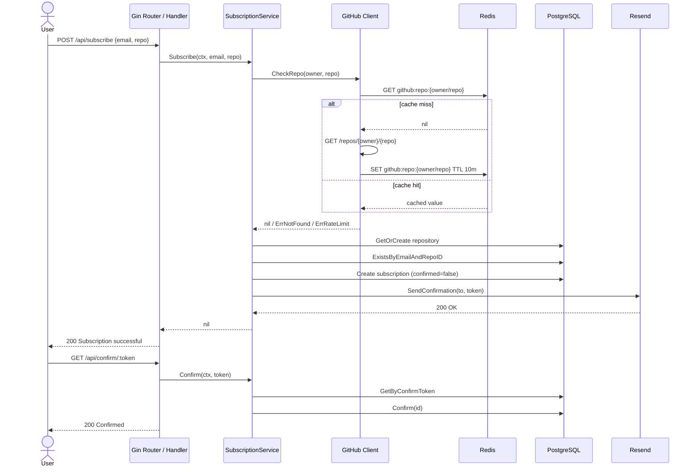
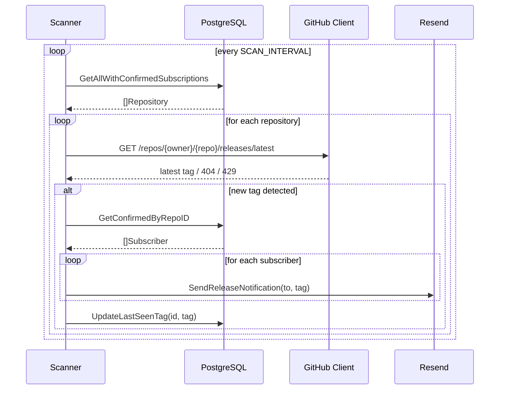
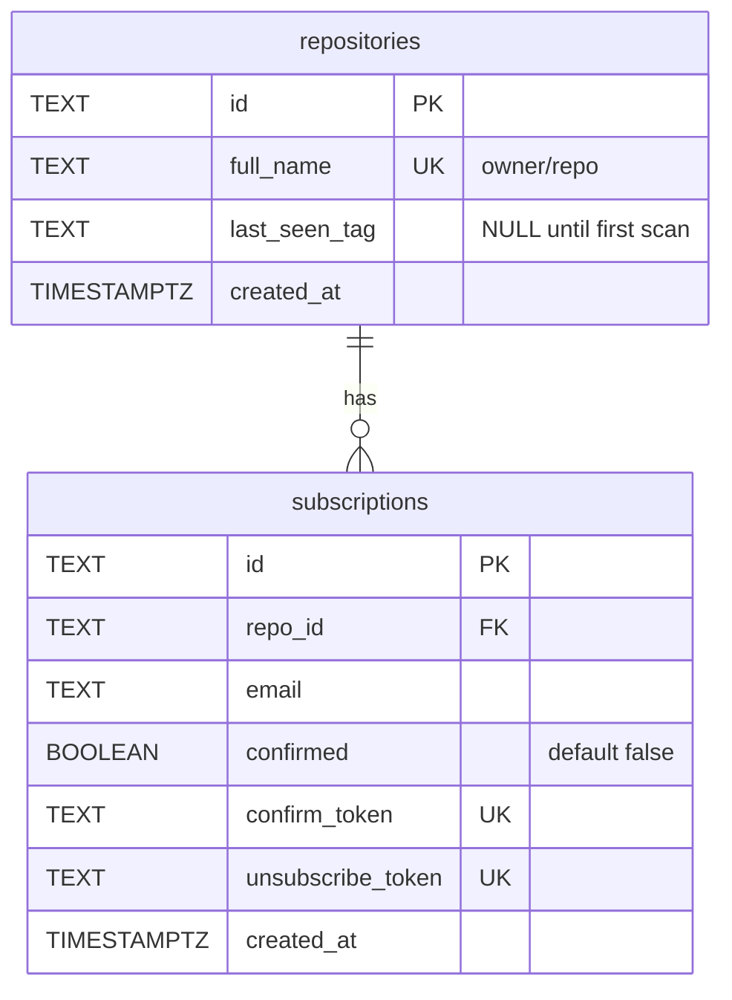

# Software Design Document

> Single deployable binary: HTTP server + one background goroutine (Scanner). No microservices; no message broker.

---

## Table of Contents

- [1. System Requirements](#1-system-requirements)
- [2. Constraints](#2-constraints)
- [3. System Overview](#3-system-overview)
- [4. Architecture](#4-architecture)
- [5. Sequence Diagrams](#5-sequence-diagrams)
- [6. Data Model](#6-data-model)
- [7. External Interfaces](#7-external-interfaces)
- [8. Non-Functional Properties](#8-non-functional-properties)
- [9. Failure Modes](#9-failure-modes)
- [10. Security](#10-security)

---

## 1. System Requirements

### Functional Requirements

| # | Requirement |
|---|---|
| FR-1 | A user can subscribe to releases of a GitHub repository by providing an email address and a repository name in `owner/repo` format. |
| FR-2 | The system validates the email format and the repository name format before processing a subscription. |
| FR-3 | The system verifies that the repository exists on GitHub before creating a subscription. |
| FR-4 | A newly created subscription is inactive (`confirmed=false`) until the user confirms it via an emailed link (double opt-in). |
| FR-5 | The user can confirm a subscription by following a unique tokenized link sent to their email. |
| FR-6 | The user can unsubscribe by following a unique tokenized link included in every release notification email. |
| FR-7 | The user can list all their confirmed subscriptions by querying with their email address. |
| FR-8 | The system periodically scans GitHub for new releases across all repositories that have at least one confirmed subscriber. |
| FR-9 | When a new release tag is detected, all confirmed subscribers of that repository receive an email notification containing the release details and an unsubscribe link. |
| FR-10 | The service exposes a health-check endpoint and Prometheus metrics. |

### Non-Functional Requirements

| Category | Requirement | Target |
|---|---|---|
| Availability | Service must degrade gracefully when Redis is unavailable; caching is disabled but the service continues to function. | No downtime on Redis failure |
| Reliability | Unconfirmed subscriptions never receive release notification emails. Release notifications use **at-least-once delivery**: `last_seen_tag` is updated in the DB only after all emails for a repo are dispatched. A process crash between email dispatch and the DB write causes the same release to be re-notified on the next scan cycle. | No notifications to unconfirmed addresses; duplicate notifications possible on crash |
| Performance | GitHub repository existence checks are cached to avoid redundant API calls on repeated subscribe requests. | ≤ 1 uncached GitHub call per repo per 10 min |
| Rate-limit safety | Scanner aborts the current scan cycle immediately upon receiving a GitHub 429 response to avoid exhausting the API quota. | No banned tokens |
| Observability | HTTP request counts, latency histograms, email counters, and GitHub API call counters are exposed as Prometheus metrics at `/metrics`. | All key operations instrumented |
| Security | Write and list endpoints require an `X-API-Key` header when `API_KEY` is configured. All SQL parameters use positional placeholders. | No unauthenticated mutations |
| Portability | The entire application is packaged as a single Docker image; configuration is injected exclusively via environment variables. | Runs on any OCI-compatible runtime |

---

## 2. Constraints

### Technical Constraints

- **Single binary**: the entire service is compiled into one executable — no microservices, no sidecar processes, no message broker.
- **GitHub API rate limits**: unauthenticated requests are capped at 60 req/h; authenticated requests at 5 000 req/h. The scanner and subscribe flow must stay within these limits. Redis caching and scan-interval tuning are the primary mitigations.
- **Go 1.25**: the codebase targets Go 1.25; no earlier version is supported.
- **Resend as the sole email provider**: all transactional email goes through the Resend HTTP API. Switching to another provider requires replacing `internal/email/sender.go`.
- **PostgreSQL schema migrations are applied at startup**: the binary embeds migration files and runs them automatically via `golang-migrate`; there is no separate migration step in the deployment pipeline.

### Business Constraints

- **Double opt-in is mandatory**: no release notification may be sent to an address that has not confirmed its subscription. This protects against abuse and unsolicited email.
- **GitHub token is optional but required for production use**: without a token the service is limited to 60 GitHub API requests per hour, which is insufficient for any non-trivial number of repositories or subscribers.
- **Unsubscribe must always be possible**: every release notification email must include a working one-click unsubscribe link.

### Infrastructure Constraints

- **PostgreSQL 16+** is required as the authoritative data store.
- **Redis 7** is optional; the service starts and operates without it, trading off repeated GitHub API calls for cache misses.
- **Docker and Docker Compose** are used for local development and the reference deployment (`docker-compose.yml` defines `postgres`, `redis`, and `app` services with health-check dependencies).

---

## 3. System Overview



1. A user submits their email and a GitHub repository via the web form.
2. The service verifies the repository exists on GitHub, saves the subscription as unconfirmed, and sends a confirmation email.
3. The user clicks the confirmation link — the subscription becomes active.
4. The Scanner periodically polls GitHub for new release tags.
5. When a new tag is detected, every confirmed subscriber receives a release notification email with an unsubscribe link.

---

## 4. Architecture

### Technology Stack

| Layer | Technology |
|---|---|
| Language | Go 1.25 |
| HTTP framework | Gin |
| Database | PostgreSQL 16 |
| Cache | Redis 7 |
| Email delivery | Resend HTTP API |
| Containerisation | Docker, Docker Compose |

### Components



**Gin Router** — entry point for all HTTP traffic. Middleware stack: `gin.Recovery`, Prometheus instrumentation. `APIKeyAuth` middleware is implemented (`internal/middleware/auth.go`) but not currently wired into the router.

**SubscriptionService** — orchestrates the subscribe flow: input validation, GitHub existence check, DB upsert, confirmation email dispatch.

**Scanner Worker** — single goroutine started at boot. Iterates all repositories with at least one confirmed subscriber, fetches the latest release tag from GitHub, compares it against `repositories.last_seen_tag`, and dispatches notification emails when a new tag is found.

**GitHub Client** — wraps GitHub REST API calls; uses Redis to cache repo-existence responses for 10 minutes.

**Email Sender** — renders HTML templates and posts to the Resend API.

**DB Layer** — all PostgreSQL access via `pgx`; no ORM.

**Redis** — optional; if unavailable the service falls back to live GitHub API calls.

---

## 5. Sequence Diagrams

### Subscription flow



### Release notification flow



---

## 6. Data Model

### Entity-Relationship Diagram



### Tables

```
repositories
─────────────────────────────────────────────────────
id            TEXT  PRIMARY KEY
full_name     TEXT  UNIQUE NOT NULL          (owner/repo)
last_seen_tag TEXT                           (NULL until first scan)
created_at    TIMESTAMPTZ NOT NULL

subscriptions
─────────────────────────────────────────────────────────────────────────
id                TEXT  PRIMARY KEY
repo_id           TEXT  NOT NULL  REFERENCES repositories(id) ON DELETE CASCADE
email             TEXT  NOT NULL
confirmed         BOOLEAN NOT NULL DEFAULT FALSE
confirm_token     TEXT  UNIQUE NOT NULL
unsubscribe_token TEXT  UNIQUE NOT NULL
created_at        TIMESTAMPTZ NOT NULL
UNIQUE (email, repo_id)
```

### Relations

| Relation | Type | Details |
|---|---|---|
| `subscriptions.repo_id` → `repositories.id` | Many-to-one | A repository can have many subscriptions; a subscription belongs to exactly one repository. `ON DELETE CASCADE` removes all subscriptions when a repository row is deleted. |

### Indexes

| Table | Index | Columns | Purpose |
|---|---|---|---|
| `repositories` | PK | `id` | Row lookup by surrogate key |
| `repositories` | `idx_repositories_full_name` | `full_name` | `GetOrCreate` lookup by `owner/repo` string |
| `subscriptions` | PK | `id` | Row lookup by surrogate key |
| `subscriptions` | `idx_subscriptions_repo_id` | `repo_id` | Join / filter subscriptions for a given repository |
| `subscriptions` | `idx_subscriptions_email` | `email` | List subscriptions by email address |
| `subscriptions` | `idx_subscriptions_confirmed` | `confirmed` | Efficiently filter confirmed/unconfirmed rows during scan |
| `subscriptions` | `idx_subscriptions_confirm_token` | `confirm_token` | Token lookup on confirmation click |
| `subscriptions` | `idx_subscriptions_unsubscribe_token` | `unsubscribe_token` | Token lookup on unsubscribe click |
| `subscriptions` | `subscriptions_email_repo_unique` | `(email, repo_id)` | Enforce one subscription per email+repo pair |

`last_seen_tag` is NULL until the repository is scanned for the first time and serves as the baseline for detecting new releases. `confirmed` guards against unverified addresses receiving notifications. Both tokens are UUID v4 and are never reused across subscriptions.

---

## 7. External Interfaces

### GitHub API

Both calls use `Authorization: Bearer <GITHUB_TOKEN>` when a token is provided.

| Call | Endpoint | Trigger | Error handling |
|---|---|---|---|
| Repository existence check | `GET /repos/{owner}/{repo}` | On every subscribe request | 404 → reject; 429 → reject; other non-200 → 500 |
| Latest release | `GET /repos/{owner}/{repo}/releases/latest` | Each scan cycle per repository | 404 → no releases yet, skip silently; 429 → abort scan cycle; other non-200 → log and skip |

Existence responses are cached in Redis for 10 minutes. Latest release responses are never cached.

### Resend API

`POST https://api.resend.com/emails` — two message types: confirmation and release notification. HTML bodies rendered from `html/template` templates embedded at compile time.

---

## 8. Non-Functional Properties

| Property | Value | Rationale |
|---|---|---|
| Scan interval | 1 hour (default) | Configurable via `SCAN_INTERVAL`; balances latency against GitHub rate limits |
| GitHub cache TTL | 10 minutes | Reduces repeated existence checks for recently validated repos |
| GitHub HTTP timeout | 10 seconds | Prevents scanner stalling on slow API responses |
| HTTP server read/write timeout | 15 seconds | Mitigates slow-loris attacks |
| DB connect timeout | 5 seconds | Fails fast at startup if PostgreSQL is unreachable |
| Redis dial timeout | 5 seconds | Application degrades gracefully if Redis is unavailable |
| Email HTTP timeout | 10 seconds | Prevents notification goroutine blocking on Resend latency |

---

## 9. Failure Modes

| Component | Failure | System behaviour |
|---|---|---|
| **PostgreSQL** | Unavailable at scan start | `scan()` logs the error and returns early; the scan cycle is skipped entirely. HTTP handlers return 500 for any request that touches the DB. |
| **PostgreSQL** | `UpdateLastSeenTag` fails after emails sent | Error is logged; `last_seen_tag` is not updated. The same release is re-detected on the next scan cycle — subscribers receive a duplicate notification (at-least-once delivery). |
| **GitHub API** | 429 Rate limit during scan | Scanner stops the current cycle immediately and resumes on the next tick. Repositories not yet checked in that cycle are skipped until the next scan. |
| **GitHub API** | 404 on latest release | Treated as "no releases yet" — repository is silently skipped. |
| **GitHub API** | Other non-200 response during scan | Error is logged; that repository is skipped for the current cycle. |
| **Resend** | Email delivery fails for one subscriber | Error is logged; the scanner continues to the next subscriber. The failed subscriber does not receive the notification for this release. `last_seen_tag` is still updated after the loop, so the notification is not retried on the next scan. |
| **Redis** | Unavailable at startup or runtime | Cache is disabled for the duration of the outage. Every subscribe request falls back to a live GitHub API call. Service continues to function; rate limit consumption increases. |

---

## 10. Security

**API key authentication** — `APIKeyAuth` middleware is implemented and checks `X-API-Key` when `API_KEY` is set, but is not currently registered in the router.

**Double opt-in** — Confirmation email is sent before the subscription is marked active. No notifications are dispatched to an unconfirmed address.

**Token design** — Each subscription carries two independent UUID v4 tokens: `confirm_token` and `unsubscribe_token`. Tokens are single-use and never reused.

**Input validation** — Email format and repository name are validated before any DB or API call. All SQL parameters use positional placeholders — no string interpolation.